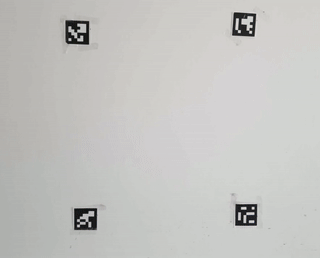

# Augmented Reality with ArUco Markers

<!-- TABLE OF CONTENTS -->

  
Table of Contents

  <ol>
    <li>
      <a href="#introduction">Introduction</a>
    </li>
    <li>
      <a href="#tools">Tools</a>
    </li>
    <li><a href="#data">Usage</a></li>
    <li><a href="#methodology">Methodology</a></li>
    <li><a href="#results">Results</a></li>
  </ol>

### Introduction
ArUco stands for Augmented Reality University of Cordoba. It was developed by Garrido-Jurado et al in 2014. It is a square with black background and boundaries and a white generated pattern. They can be generated in a variety of sizes, according to the usage. 

The idea of this project is to use ArUco markers on objects to stream a video. 

### Tools
Python 3, Numpy, OpenCV

### Methodology
The camera is activated, and when 4 ArUco markers are detected, a get frame function is called.

<b>get_frame()</b> function is responsible for finding the outer frame of the detected markers, in which the video will be streamed. The function arrange markers according to their location and detect the points below, returning them in a list.

The video is then warpped to the observed frame, and streamed.

### Results

